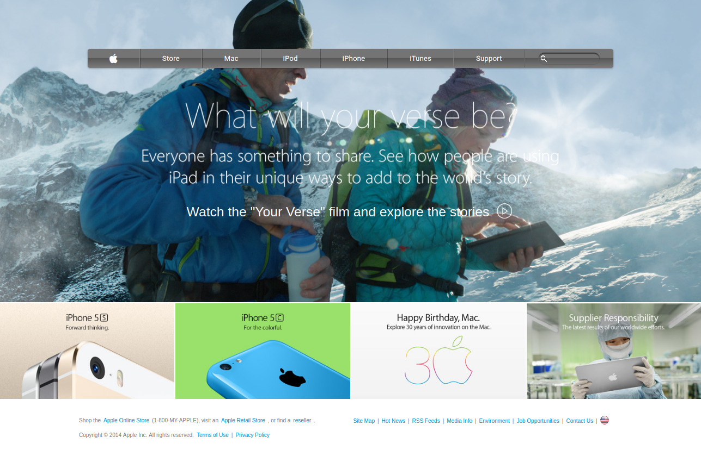

# Apple-Page-clone-Project

> The page is a clone of an Apple web page.



This project was made to demonstrate the author's understanding of basic HTML and CSS concepts, his ability to work with backgrounds, background-images and gradients in HTML, and portray more of his understanding of embedding images in an HTML webpage.

## Built With
- HTML
- CSS

## Live Demo

[Live Demo Link](https://rawcdn.githack.com/RNtaate/roy-apple-page-project/a9efc12cfbb87b3c7ac9b39be3693978bdd77bb0/index.html)


## Getting Started
To get a local copy of this repository, please run the following commands on your terminal

```
$ cd <folder>
```

```
$ git clone https://github.com/RNtaate/roy-apple-page-project.git
```

## Authors

👤 **Roy Ntaate**

- Github: [@RNtaate](https://github.com/RNtaate)
- Twitter: [@RNtaate](https://twitter.com/RNtaate)
- Linkedin: [roy-ntaate](https://linkedin.com/in/roy-ntaate)


# 🤝 Contributing

Contributions, issues and feature requests are welcome!

Feel free to check the [issues page](https://github.com/RNtaate/roy-apple-page-project/issues).

## Show your support

Give a ⭐️ if you like this project!

## Acknowledgments

- This project was originally taken from [The Odin project](https://www.theodinproject.com/courses/html5-and-css3/lessons/building-with-backgrounds-and-gradients)
- The project was inspired by the [Microverse](https://www.microverse.org/) program.

## 📝 License

This project is [MIT](lic.url) licensed.
